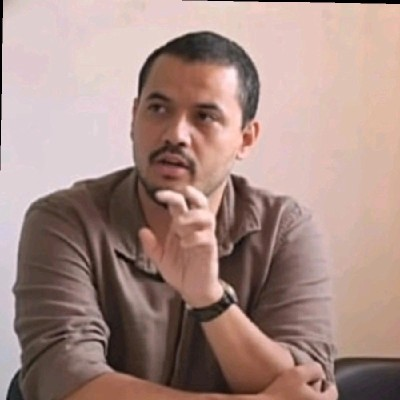

```{=html}
<div class="intro-panel">
  <h2>Nossa pesquisa combina economia aplicada, avaliação de políticas públicas e ciência de dados.</h2>
  <p>Os pesquisadores do Núcleo MAPA atuam em projetos voltados à produção de diagnósticos, avaliação de políticas públicas e comunicação de evidências com rigor metodológico e linguagem acessível.</p>
</div>
```

## Pesquisadores

```{=html}
<div class="researchers-grid">
  <article class="researcher-card">
    <div class="researcher-photo">
      
    </div>
    <div class="researcher-body">
      <h3 class="researcher-name">Fábio Rocha</h3>
      <p class="researcher-bio">Economista (UFOP), Mestre em Economia (UFABC) e filósofo (UFOP) com trajetória no setor público e em monitoramento, avaliação e produção de evidências para políticas públicas.</p>
      <div class="researcher-links">
        <a href="http://lattes.cnpq.br/1956089489809622">Lattes</a>
        <a href="https://github.com/fabiorochav">GitHub</a>
        <a href="https://www.linkedin.com/in/fábio-rocha">LinkedIn</a>
        <a href="https://www.youtube.com/@RochaDatainR">YouTube</a>
      </div>
    </div>
  </article>

  <article class="researcher-card">
    <div class="researcher-photo">
      
    </div>
    <div class="researcher-body">
      <h3 class="researcher-name">Caio Sousa</h3>
      <p class="researcher-bio">Engenheiro de Produção (UFRJ) e Mestre em Economia (UFABC), com experiência no mercado financeiro, possui trajetória em análise de dados, macroeconomia, microeconometria e avaliação de políticas públicas.</p>
      <div class="researcher-links">
        <a href="http://lattes.cnpq.br/6328582749499772">Lattes</a>
        <a href="https://github.com/caiosousareis">GitHub</a>
        <a href="https://www.linkedin.com/in/caiosousareis/">LinkedIn</a>
      </div>
    </div>
  </article>

  <article class="researcher-card">
    <div class="researcher-photo">
      
    </div>
    <div class="researcher-body">
      <h3 class="researcher-name">Andrei Santos</h3>
      <p class="researcher-bio">Estatístico (UFOP) e cientista de dados com expertise em modelagem e análise aplicadas, combinando ferramental estatístico com programação.</p>
      <div class="researcher-links">
        <a href="https://www.linkedin.com/in/andrei0118-santos/">LinkedIn</a>
      </div>
    </div>
  </article>
</div>
```
